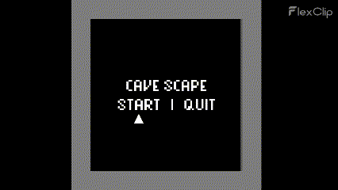
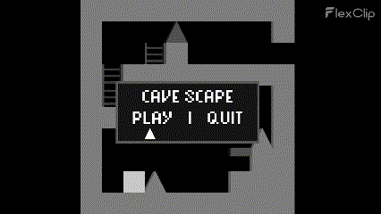

# Cave Scape

## Introduction
Game developed in C++ using the opencv2 library.

This game was developed as an optional work for the course "Introduction to Programming" of the Computer Engineering degree at UCO. The language used is C++ together with a library called "opencv2" for the creation of windows.

## Gameplay
This game is about a square character who has to scape from a cave. During his adventure he will find a lot of dangers like spikes or high platforms.

Images of the game:

Also I added a pause menu, a defeat screen and a win screen:

## Video

For this course I also did a video shown how I develop this project:

